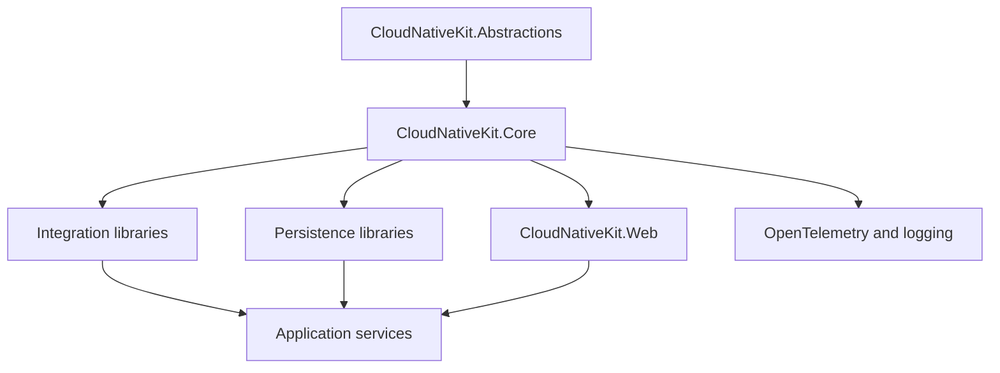

# Architecture

CloudNativeKit is organized as small libraries with explicit project references. Lower-level abstractions and core services sit below optional integrations.

## Package boundaries

- `CloudNativeKit.Abstractions` contains contracts and shared models.
- `CloudNativeKit.Core` contains common application, domain, messaging, and event-store behavior.
- Persistence packages integrate PostgreSQL, MongoDB, Marten, EventStoreDB, and Azure data stores.
- Integration packages connect application code to Wolverine, caching, email, security, health checks, and observability tooling.
- `CloudNativeKit.Web` contains ASP.NET Core integration helpers.

Packages are independently consumable but use the same version and central dependency management.
